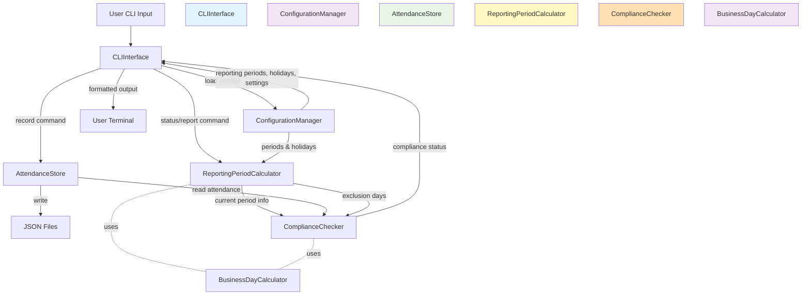

# Architectural Blueprint

## 1. Core Objective

Build a single-user command-line application that tracks daily in-office vs. remote attendance, calculates compliance against configurable Return-to-Office (RTO) policies requiring minimum in-office days per 13-week reporting period, accounts for holidays and exclusion days that reduce requirements, and provides status reports—all using file-based storage without database dependencies.

## 2. System Scope and Boundaries

### In Scope

- Record daily attendance status (in-office or remote) for workdays
- Calculate and display current reporting period with deadline information
- Track compliance against configurable minimum in-office day requirements
- Automatically exclude weekends from workday calculations
- Support configurable exclusion days (holidays, company shutdowns) that reduce required in-office days
- Define multiple 13-week reporting periods with start dates, end dates, and deadlines
- Generate compliance reports showing in-office days recorded, required days, and remaining workdays
- Validate all configuration files on startup
- Store attendance data in JSON files organized by year
- Support retroactive attendance recording for past dates
- Configuration via TOML (application settings, reporting periods) and YAML (holiday calendars)
- Command-line interface with subcommands: record, status, report, config

### Out of Scope

- Multi-user support or team/manager dashboards
- Database integration (PostgreSQL, MySQL, SQLite)
- Web-based user interface or REST API
- Authentication and access control
- Email notifications or reminders
- Calendar integration (Google Calendar, Outlook)
- Mobile application
- Real-time synchronization across devices
- Partial day tracking (half-days, specific hours)
- Multiple attendance status types beyond in-office/remote (e.g., PTO, sick leave, vacation)
- Automated data export to external systems
- Manager approval workflows
- Historical data analytics or trend visualization
- Support for part-time employees or variable schedules
- Timezone handling (assumes local timezone)

## 3. Core System Components

| Component Name | Single Responsibility |
|---|---|
| **CLIInterface** | Processes user commands (record, status, report, config), validates command-line arguments, and renders formatted output to the terminal |
| **ConfigurationManager** | Loads, parses, validates, and provides access to all configuration data including application settings (TOML), reporting periods (TOML), and holiday calendars (YAML) |
| **AttendanceStore** | Persists daily attendance records to JSON files and retrieves historical attendance data for specified date ranges |
| **ReportingPeriodCalculator** | Determines which reporting period contains a given date, calculates total workdays in a period, and counts exclusion days that fall within periods |
| **ComplianceChecker** | Evaluates whether recorded attendance meets requirements by comparing in-office day counts against effective required days for a reporting period |
| **BusinessDayCalculator** | Computes business day counts between dates, identifies weekends, validates if a date is a workday, and determines if a date is an exclusion day |

## 4. High-Level Data Flow



## 5. Key Integration Points

- **CLIInterface ↔ ConfigurationManager**: Direct function calls; CLIInterface requests configuration objects (settings, periods, holidays) during command initialization
- **CLIInterface ↔ AttendanceStore**: Direct function calls; CLIInterface invokes save/retrieve methods passing date and status parameters, receives attendance records
- **CLIInterface ↔ ReportingPeriodCalculator**: Direct function calls; CLIInterface requests current period determination and workday calculations
- **CLIInterface ↔ ComplianceChecker**: Direct function calls; CLIInterface requests compliance evaluation for specified reporting periods
- **ReportingPeriodCalculator ↔ BusinessDayCalculator**: Direct function calls; ReportingPeriodCalculator delegates all date arithmetic and workday validation to BusinessDayCalculator
- **ComplianceChecker ↔ BusinessDayCalculator**: Direct function calls; ComplianceChecker uses BusinessDayCalculator to count remaining workdays in period
- **ComplianceChecker ↔ AttendanceStore**: Direct function calls; ComplianceChecker retrieves attendance records for date range analysis
- **ComplianceChecker ↔ ReportingPeriodCalculator**: Direct function calls; ComplianceChecker requests effective required days (baseline minus exclusions) for periods
- **ConfigurationManager ↔ File System**: File I/O; reads TOML files using tomllib (Python 3.11+) or tomli (3.10), reads YAML using pyyaml, validates with Pydantic
- **AttendanceStore ↔ File System**: File I/O; reads/writes JSON using Python's json module, creates data directory if missing, organizes by year (attendance_YYYY.json)
- **Data Format**: All inter-component communication uses Python dataclasses (ReportingPeriod, AttendanceRecord, ComplianceStatus, ConfigSettings) for type safety
- **Error Handling**: All components raise custom exceptions (ConfigurationError, StorageError, ValidationError) caught and formatted by CLIInterface
- **Authentication**: Not applicable (single-user, local file system application)

---

## Component Dependencies

```
CLIInterface
  ├─ ConfigurationManager
  ├─ AttendanceStore
  ├─ ReportingPeriodCalculator
  │    └─ BusinessDayCalculator
  └─ ComplianceChecker
       ├─ AttendanceStore
       ├─ ReportingPeriodCalculator
       └─ BusinessDayCalculator
```

**Architectural blueprint complete** with 6 core components, clear data flow visualization, and 10 integration points defined. Component names (CLIInterface, ConfigurationManager, AttendanceStore, ReportingPeriodCalculator, ComplianceChecker, BusinessDayCalculator) will be used consistently across all subsequent documents.

**Proceed to generate requirements?**
